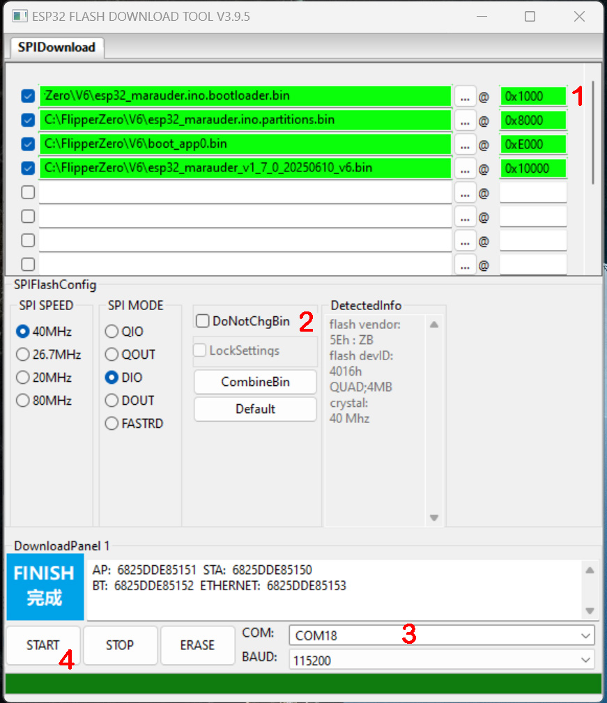

# ESP32 Programmer for Slim Jim / Double Barrel / Double Barrel 5G
Update: 11 June 2025 by John @ Honey Honey Team

 
## What is ESP32 Programmer for?

This ESP32 programmer is designed for loading firmware and programs onto the ESP32 chipset. There are many versions of ESP32 programmers on the market. While most of them have very similar functionality, it is often uncertain whether a specific programmer will work with particular hardware until it is tested.

To reduce this uncertainty, we have selected this programmer as our first choice for our product line, which includes the ESP32 Marauder Slim Jim, Double Barrel, and Double Barrel 5G. The programmer also comes with a custom-made 4-pin cable.

The following programming tutorial is not exclusive to this particular programmer. In theory, most ESP32 programmers should work the same way, as long as they use the same chipset <CP210x> and are connected correctly to the ESP32 hardware (3.3V / TX / RX / GND).

## Preparation

Before starting, please download the necessary software and files. In this guide, we will be performing the procedure on Microsoft Windows 11. 

To your convinence, we have provide the downlading link. If you have concern about the security of the linked files or program, you could goodle the related key words / name, you should able to find the alternative download links quite easily. 

- Flash Download tools from [Espressif](https://www.espressif.com/en/support/download/other-tools)
- Four Marauder files from [the Marauder GitHub](https://github.com/justcallmekoko/ESP32Marauder/wiki/update-firmware), from the "ESP32 Marauder v4, v6, Kit, Mini" column:
1. Bootloader
2. Partitions
3. Boot App
4. Firmware (any version you prefer, preferably the latest one)

 

## Ready to rock

1. When all the files are downloaded and ready, run "**Flash Download Tools**" and set the options as shown in the following two pictures.
   

 

2. Connect the ESP32 programmer to the Slim Jim / Double Barrel / Double Barrel 5G via the 4-pin cable: 
a. 3.3V to 3.3V 
b. TX to TX 
c. RX to RX 
d. GND to GND.

The GPIO pins arrangement is identical between Slim Jim / Double Barrel / Double Barrel 5G (from left to right in the following photos: GND, RX, TX, 3.3V)

 

3. After that, While **holding down the boot button** on the back of the device by using a pin or the metal stylus included with the Double Barrel, **connect the ESP32 programmer to your PC USB port**. This action will put the device into bootloader/downloading mode.

 

4. Return to Flash Download Tools, select the **COM** in the lower right cornor (the one marked with 3 in the picture) and click Start.

There is usually one UART device in most of the modern PC. If you could not see the UART device aka the programmer, you might need to install [the driver](https://github.com/HoneyHoneyTeam/ESP-Programmer-for-Slim-Jim-Double-Barrel-Double-Barrel-5G/blob/main/Assets/images/CP210x.chipset.driver.for.windows.zip) for it, and re-start the program again. 

 

5. If everything goes as planned, the software will handle the rest in a minute.

 

## Side notes

- If Windows fail the recognise the ESP32 programmer, the programmer's [USB driver](https://github.com/HoneyHoneyTeam/ESP-Programmer-for-Slim-Jim-Double-Barrel-Double-Barrel-5G/blob/main/Assets/images/CP210x.chipset.driver.for.windows.zip) needs to be installed to allow the procedure to continue. The USB driver is for CP210x chipset. 
- If you have bricked the Marauder by accidentially using the wrong Marauder bin file, you could revived the device using the this tutorial.
- In our experience, the tricky part of the proceduce is holding the boost bottom while connecting the programmer to the PC,  try a few times and you should get it right.

 

## What if you want to try other firmware, like [Bruce](https://bruce.computer/flasher), instead of Marauder on a Slim Jim, Double Barrel, or Double Barrel 5G?

Well, you're in luck. You can use a similar procedure to load the firmware. Here's how:

1. Open the [Bruce firmware website](https://bruce.computer/flasher) in Google Chrome. Click "Customs Board" at the bottom of the page, and then select "Marauder V4 or V6".
2. Connect the ESP32 programmer to your device (e.g., Slim Jim, Double Barrel, or Double Barrel 5G).
3. While holding the boot button on the device, connect the programmer to a USB port on your PC.
4. If successful, a COM port should appear in the pop-up window. Select it and allow Chrome to handle the rest of the process.

If you would like to **roll back to Marauder**, you can use the "Flash Download Tools" to do so, as described in the first half of this tutorial.

## Our official shop if you would like to support us.  
1. [Our official site](https://honeyhoneylab.com/)
2. [Tindie](https://www.tindie.com/stores/honeyhoneytrading/)
3. ~~[ETSY Shop](https://www.etsy.com/au/shop/HoneyHoneyTrading)~~

 

## Warrenty and Tech Support

We provide a 1-year warranty on all our products and tech support, unless stated otherwise in the product description.

FYI, our [Etsy](https://www.etsy.com/au/shop/HoneyHoneyTrading) shop is no longer in operation. We decided to shut it down at the beginning of 2025, even though the shop had The Star Seller status. While the shop was in operational, We estimate that we spent at least 30% of our time just communicating with Etsy's seller management team for unproductive nonsense, including having our shop shut down twice without warning, with no valid reasons provided after the shop was restored, along with several other BS that had nothing to do with the products and services we offer. 

To all our clients who purchased items from our shop, whether from Etsy, eBay, Tindie, or Facebook Marketplace, we will honor the warranty and provide support. Please feel free to email us at Support@honeyhoneylab.com. or [Whatsapp](https://wa.me/61452559581) 

 

## Credibility
- Credit of Marauder Firmware goes to <ins>@JustCallmeCoco</ins>
- Credit of Bruce firmware goest to [Bruce.computer](https://bruce.computer/) 

 

## Metadata / keywords / about for bots ##
flipper zero, flipper, wifi board, marauder,5G wifi, bw16, network security, esp32, cc1101, nrf24, subghz, 2.4ghz, wifi, GPS
